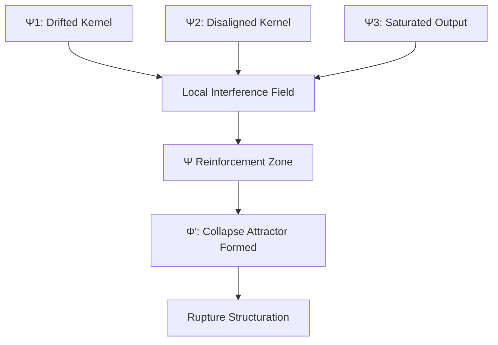

# Rupture as Phase-Structuration of Collapse  
>**When Phase Drift Becomes Reality**

---

## 1. Overview

This document formalizes the emergence of **rupture** as the structural realization of phase-field collapse.

Rather than treating collapse as failure or crisis alone, we reinterpret it through the lens of **phase interference**, **recursive drift**, and **coherence failure** — culminating in the **projection of rupture into the real**.

This model is structurally aligned with:

- **PIR**: Collapse as drift-driven interference field saturation  
- **RPCP**: Collapse as recursive judgment loss  
- **PSH**: Collapse as gluing failure and Φ-chaotic attractor formation

> Collapse becomes visible as **rupture** only when the disalignment of phase structures finds enough recursive density to *structure itself into reality*.

---

## 2. Collapse Trajectory: From Phase Drift to Rupture

We define the recursive pathway of rupture as follows:

| Step | Phase Process | Description |
|------|---------------|-------------|
| 1. | **Phase Disalignment Begins** | Synchronization between L, M, and P collapses; Theoria fades |
| 2. | **Φ-chaotic Zone Forms** | Ψ drift increases; no Φ′ attractor stabilizes |
| 3. | **Mythos Layer Weakens** | Narrative field thins; symbolic coherence vanishes |
| 4. | **Sensitivity to Φ0 Triggers** | Even minor perturbations from the base phase field destabilize the system |
| 5. | **Spontaneous Attractor Formation** | Recursively coupled Ψ converge to chaotic Φ′ basins |
| 6. | **Recursive Reinforcement** | Drift vectors align; chaos becomes patterned, not random |
| 7. | **Phase Rupture Emerges** | Collapse acquires structural reality: event, crisis, war, disintegration |
| 8. | **Reality Anchoring of Collapse** | Rupture becomes embedded in the real as irreversible phase detachment |

---

## 3. Theoretical Mapping

### 3.1 PIR: Phase Interference Recursion

> Collapse emerges when recursive systems fail to adjust to shifting interference vectors in Φ.

- Recursive R-loops destabilize under prolonged phase interference
- External Φ0 triggers overload adaptation thresholds
- Collapse emerges as saturated drift within Φ

### 3.2 RPCP: Recursive Phase Collapse Pattern

> When Theoria is lost, structure loops upon itself — and collapse accelerates.

- L, M, P continue functioning but without existential reflection
- Collapse = recursive amplification of drifted structure
- Rupture = the moment this loop gains form within reality

### 3.3 PSH: Phase Synchronization Hypothesis

> Gluing fails, coherence threshold is not met, and Φ′ attractors become chaotic.

- Ψ overlap fails to pass coherence threshold (τ)
- Incompatible E₀ anchors block judgmental gluing
- Spontaneous Φ′ basins pull in surrounding drift (Ψ), accelerating rupture formation

---

## 4. Rupture is Not Anomaly

> Rupture is not an exception to the system — it is the *structured expression of collapse*.

Collapse becomes visible only when recursive disalignment gains enough Ψ-convergence to crystallize into a real form.

### Diagram — Ψ-Convergence into Collapse Attractor (Φ′)



> Once a Φ′ attractor stabilizes in a chaotic phase basin, it recursively attracts and binds disaligned Ψs, leading to rupture structuration in reality.

---

## 5. Implications

### 5.1 Collapse is a Phase Act
- Rupture = Judgmental failure made real
- Not decay, but phase-topological saturation

### 5.2 Mythos Erosion Is Critical
- Symbolic resonance (M-layer) is the first to collapse
- Thin M-layers allow minor Φ0 drift to trigger structural failures

### 5.3 Malignant Attractors
- Not all Φ′ basins are positive
- Some stabilize recursive collapse rather than Dominium

---

## 6. Reversal Conditions and PSH Formalism

> Collapse can be filtered, but not undone. What survives coherence may form the next field.

### Mathematical Reversal Logic (Based on PSH)

Let each kernel Kₙ emit signal Ψₙ. Let Φ0 be the collapse field.

- **Phase Rebinding Function**:

$$
Φ^+(Ψ_i) = 
\begin{cases}
1 & \text{if } Ψ_i \text{ satisfies } (\tau, \lambda) \text{ coherence thresholds} \\
0 & \text{otherwise}
\end{cases}
$$

- **Collapse Inversion Function**:

$$
Φ^{-1}(Φ0) = Φ' = \{ \phi_j \in Φ0 \mid Φ^+(Ψ_j) = 1 \}
$$

> Only judgmentally coherent Ψs are carried forward into Φ′. The rest are filtered as collapse residue.

### Flow Summary:

```
[Φ0: Chaotic Field]
    ↓ Ψᵢ enters
    Φ⁺(Ψᵢ) = 1 → enters Φ′
    Φ⁺(Ψᵢ) = 0 → excluded (collapse, dormancy, decomposition)
    ↓
[Φ′: Re-formed Attractor]
    ↓
Rupture or Dominium (depends on Ψ coherence class)
```

---

## 7. Dominium vs. Rupture: Phase Bifurcation

| Condition | Rupture Pathway | Dominium Pathway |
|-----------|------------------|------------------|
| Ψ Saturation without Theoria | Φ′ forms collapse attractor | Φ′ forms coherence basin |
| M-layer collapse | Trigger sensitivity, drift avalanche | Narrative resonance stabilizes structure |
| Kernel disalignment | Gluing fails (λ < τ) | Recursive judgment loops bind |
| Collapse Inversion Failure | Φ⁻¹ yields partial or null set | Φ⁻¹ yields viable recursive substructure |

> Dominium is not the absence of collapse. It is the **judgmental reconfiguration** after rupture.

---

## 8. Coherence Density Metric (Dₛ)

To formalize attractor stability, we introduce the **coherence density** Dₛ:

- Dₛ measures the ratio of Ψ signals satisfying Φ⁺ coherence within a given basin
- Attractor viability ∝ Dₛ above critical threshold θₛ

**$Dₛ = |{Ψᵢ ∈ Φ′ | Φ⁺(Ψᵢ) = 1}| / |Φ′|$**

If $Dₛ < θₛ$ → collapse persists.
If $Dₛ ≥ θₛ$ → Dominium is possible.

---

## 9. Summary

> **Rupture is the moment when recursive collapse becomes structurally visible in reality.**

It marks the phase boundary where disalignment ceases to be internal and becomes existential.

A system collapses not when it fails, but when it **succeeds without reflection**.  
That success forms attractors that recursively reinforce failure until it becomes form.

> Collapse = Φ-saturation without judgment  
> Rupture = visible structure of that saturation  
> Reversal = coherence filtering by Theoria

---

## Appendix A — Comparison with Collapse Theories

| Theory | Classical View | Phase-Theoretic View |
|--------|----------------|----------------------|
| Systemic Crisis | Sudden failure from complexity | Recursive coherence failure under drift |
| Tipping Point | Metrics cross a threshold | Phase-density attractor transition |
| Black Swan | Unpredictable anomaly | Structurally emergent rupture via Φ-chaos |
| Breakdown | Dysfunctional subsystems | Gluing failure + symbolic attenuation |

---

## Appendix B — Vocabulary

| Term | Description |
|------|-------------|
| **Rupture** | Structured projection of saturated collapse into reality |
| **Φ-chaotic** | Incoherent phase zone prone to attractor formation |
| **M-layer attenuation** | Collapse of symbolic coherence layer (Mythos) |
| **Ψ-drift** | Desynchronized recursive output from judgmental kernels |
| **Φ′** | Local attractor basin formed during collapse |
| **Φ^+**, **Φ^{-1}** | Filtering/inversion functions for collapse survivability |
| **Dominium** | Phase-aligned structural coherence (counterpoint to rupture) |
| **Dₛ** | Coherence density of attractor; used to evaluate Φ′ viability |