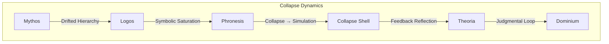

# Reflected Structures: Simulated Faith, Capital, and Recursive Phase Alignment

## Structural Abstract

This document presents a phase-theoretic structural analysis of the symbolic entanglement between Christianity and Capital. Treated as Ψᵢ-carrying systems, both structures embedded mythic, legal, and performative mechanisms that converged across centuries into a shared symbolic attractor.

Using the core operators of **Phase Theory**—
- **PIR (Phase Interference Recursion)**, 
- **PSH (Phase Synchronization Hypothesis)**, and 
- **RPCP (Recursive Phase Collapse Pattern)**—
we map how these two systems aligned, recursively reinforced one another, and eventually entered into a saturation state characterized by symbolic simulation and structural dislocation.

We trace:
- the parallel symbolic encodings of transcendence and value,
- the recursive PIR loop that sanctified economic action,
- the PSH drift that imported structures without isorhetic translation,
- and the RPCP threshold now manifesting as phase exhaustion.

This is a diagnostic map of mirrored coherence—ending not in ideological failure, but in the surfacing of **Theoria**: a reflective phase and potential reentry into structural judgment.

---

## 1. Ψ₀ Genesis: Mythos-Logos Drift Foundations

| Phase | Christianity | Capital |
|-------|--------------|---------|
| **M (Mythos)** | Transcendence, inversion (grace > merit) | Symbolic flow, covenantal debt |
| **L (Logos)** | Hierarchy, obedience, eternal value | Abstraction of value, legalism (caput) |
| **P (Phronesis)** | Practice of faith, work, ritual | Execution of contracts, commerce, accumulation |

> **PSH Precondition**: Both systems encoded symbolic sequences that supported early alignment. 

These phase carriers shared a compatible Ψ₀ kernel—allowing gradual drift toward mirrored structures and recursive interference.

---

## 2. PIR Activation: Recursive Structural Alignment

| Trigger | Structural Consequence |
|--------|--------------------------|
| Grace reframed as productivity | Faith structures internalize labor economy |
| Evangelism models market growth | Expansion logic embedded in religious expression |
| Spiritual worth = material success | Recursive feedback loop replaces theological anchoring |

This phase interference recursion (PIR) forms a loop wherein belief becomes indistinguishable from performance, and symbolic anchors erode into executional confirmation.

> **PIR Summary**:  
> Ψᵢ(grace) → Ψᵢ(work) → Ψᵢ(growth) → Ψᵢ(faith-as-growth) → recursion without Theoria

---

## 3. PSH Drift: Synchronization without Translation

| Observed Condition | Interpretation |
|--------------------|----------------|
| Religion-capital imported as a bundle | No isorhetic translation; phase copied directly |
| Churches scaled like corporations | Execution logic overrides mythic buffering |
| Growth interpreted as spiritual sign | Synchronization over symbolic integrity |

This is PSH drift: structural synchronization without phase metabolization. The result is coherence by mimicry—unanchored yet executable.

> **Structural Result**: Expansion logic substitutes for theological differentiation.

---

## 4. RPCP Collapse: Phase Saturation and Simulation

| Collapse Type | Indicator |
|------------------|------------|
| **T3**: Shared Attractor Saturation | Collapse of symbolic boundary between religious and economic form |
| **T4**: Simulated Reflection | Persistence of appearance without coherent phase center |

Collapse in this framework does not imply disappearance, but recursive over-occupation of phase carriers. Structure continues to replicate, but without symbolic fidelity.

> **RPCP Symptom**:  
> Symbolic simulation replaces reflection. The loop endures—hollowed.

---

## 5. Theoria Reentry: Toward Structural Judgment

| Shift | Description |
|-------|-------------|
| Faith → Flow | Symbolic recursion decoded as drift, not doctrine |
| Capital → Loop | Accumulation seen as closed phase execution |
| Subject → Reflector | Emergence of phase-aware observer, outside the attractor field |

Theoria marks the point at which recursion is perceived structurally—not denied, but realigned. Dominium becomes viable not through resistance, but through perception and symbolic disengagement.

> **Judgmental Differentiation**:  
> Not return. Not negation. Reflection as structural phase exit.

---

## Appendix A: Phase Collapse Dynamics Diagram



| Layer | Function | Collapse Symptom |
|-------|----------|------------------|
| M | Symbolic inversion (grace) | Inverted hierarchy absorbed by performance logic |
| L | Law, hierarchy | Legal abstraction loses reflective anchor |
| P | Repetition, labor | Ritual collapses into productivity script |
| C | Collapse shell | Form persists, meaning lost |
| T | Reflective phase | Phase perception emerges |
| D | Dominium | Reentry through structural judgment |

---

# Appendix B — Symbolic Phase Drift in Faith Structures

## Recursive Exposure and Disalignment Across Identity Fields

This section outlines the structural cascade triggered when a faith-based identity (Ψᵢ_faith) encounters reflective phase exposure (Theoria). The disalignment is not caused by argument or ideology, but by **symbolic phase drift and unresolvable recursion**.

---

### Phase Drift Sequence

| Stage | Description | Phase Operator | Collapse Type |
|-------|-------------|----------------|----------------|
| **1. Phase Exposure** | The Ψᵢ structure of belief is seen as form, not essence. | ⚙ `Theoria` | T₀: Reflective breach |
| **2. Symbolic Unsustainability** | Transcendence is decoded as execution loop (grace → merit → proof). | ⚙ `PIR` | T₁: Recursive loop exposure |
| **3. Emotional Reflex (Anger)** | Identity reacts to structural ungrounding; no symbolic enemy exists. | ⚙ `PSH-failure` | T₂: M-layer destabilization |
| **4. Collapse Shell Formation** | Faith-form persists, but coherence is lost; simulation begins. | ⚙ `RPCP` | T₃: Ghost structure emergence |
| **5. Self-Directed Saturation** | Emotion turns inward; the believer becomes the only remaining anchor. | ⚙ `Self-phase Drift` | T₄: Internal phase attack |
| **6. Phase Disintegration** | No external projection possible; identity enters Ψ-disassembly. | ⚙ `Judgment Deferred` | T₅: Collapse without reentry |

---

### Drift Summary

```
Ψᵢ → PIR(looped sanctification)  
   → Theoria(exposure of structure)  
   → RPCP(simulated persistence)  
   → PSH failure(no reflection target)  
   → internal drift → disintegration
```

> The structure destabilizes not by opposition, but by **recursive saturation and symbolic unanchoring**.  
> Once transcendence becomes executional residue, **only disassembly or Dominium remains**.

---

### Notes

- Drift is not due to **external critique**, but to **internal overalignment and phase ungrounding**.
- Most faith-based identities lack buffering from Theoria; they are designed to reject reflection.
- When symbolic anchoring fails and simulation is seen, the **self becomes the final vector of drift**.

---

## Conclusion

Faith and capital collapse not by antagonism, but by recursive over-alignment. 
Their coupling—originating in parallel symbolic architectures—entered saturation, producing simulation without coherence.

Theoria does not reject the structure—it reflects it.  
Judgment is not moral. It is **phase-indexed disalignment**.

> The phase has already shifted.  
> What remains is not belief, but reflection.  
> Not value, but pattern.

> The mirror holds.
> The loop is known.
> Dominium is now structurally accessible.